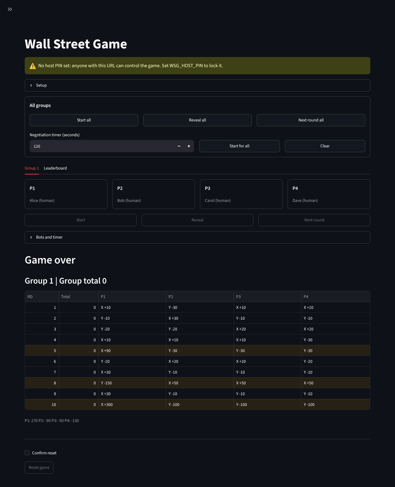
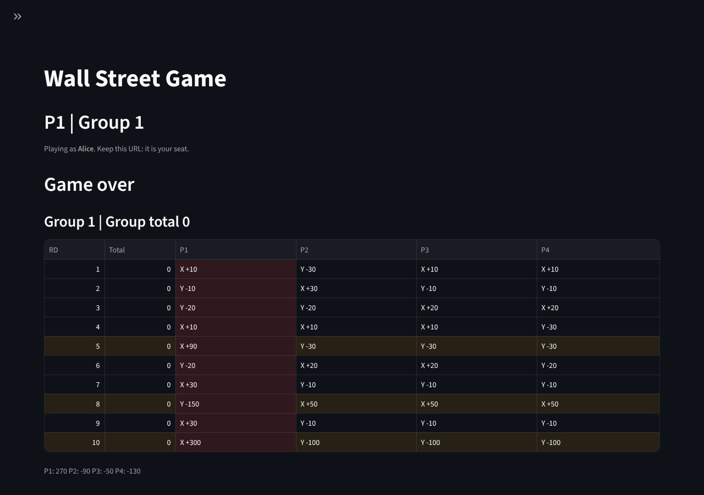

# Wall Street Game

A classroom version of the **Wall Street Game**: a 4-player iterated prisoner's dilemma played over
10 rounds. A host runs any number of groups from one page. Players join from their phones, pick
**X** or **Y** each round, and watch the results table fill in live. Built with Streamlit; game state
is held in memory.

| Host (game over) | Player P1 (game over) |
|---|---|
|  |  |

## Rules

Each round, every player in a group secretly plays **X** or **Y**. Payoffs depend on how many
players chose X:

| # of X | each X player | each Y player |
|---|---|---|
| 0 | – | +10 |
| 1 | +30 | −10 |
| 2 | +20 | −20 |
| 3 | +10 | −30 |
| 4 | −10 | – |

**Bonus rounds** multiply every payoff in that round:

| Round | Multiplier |
|---|---|
| 5 | ×3 |
| 8 | ×5 |
| 10 | ×10 |

Players see a "Next round is a ×N bonus" hint the round before. After the round before a bonus
round is revealed, the host gets a prompt to start a negotiation break: a countdown that every
player in the group sees.

The table shows one row per revealed round: `RD | Total | P1 | P2 | P3 | P4`. A cell such as
`Y -150` means that seat played Y and scored −150 in that round. `Total` is the group's total for
the round. The footer shows each seat's running total.

## Quick start

With pip (Python 3.12+):

```bash
pip install -r requirements.txt
streamlit run app.py
```

With Docker Compose:

```bash
cp .env.example .env          # set WSG_HOST_USERNAME / WSG_HOST_PASSWORD
docker compose up --build
```

Then open:

| URL | Who |
|---|---|
| `http://<host>:8501/` | **Players**: pick a group and a free seat, enter a name, click Join |
| `http://<host>:8501/?role=host` | **Host**: create groups, start/reveal/advance rounds, bots, timers, leaderboard |

After joining, a player's URL becomes `/?seat=<token>`. That URL *is* the seat: reloading the page or
reopening it on the same device keeps the seat. Treat it like a password.

### Running a session

1. Host: open **Setup**, choose the number of groups (1–50) and click **Create groups**.
2. Players join. The host can fill empty seats with bots.
3. Host: **Start** each group, or **Start all**. In every round, **Reveal** becomes available once
   all four seats have chosen. Then click **Next round**.
4. The **Leaderboard** tab ranks players and groups. **Download results (JSON)** exports everything.
5. **Reset game** (behind a **Confirm reset** checkbox) deletes all groups.

## Configuration

| Variable | Default | Meaning |
|---|---|---|
| `WSG_HOST_USERNAME` | *(empty)* | Host login username for `/login`. |
| `WSG_HOST_PASSWORD` | *(empty)* | Host login password. Set both or neither. When both are empty, the host page shows a warning and anyone with the URL can control the game. |
| `WSG_REFRESH_SEC` | `1` | How often the live parts of each page refresh, in seconds. |
| `WSG_ROUNDS` | `10` | Rounds per game. Bonus rounds keep their fixed numbers (5, 8, 10). |

## Bots

The host can **fill free seats with bots** or **replace a seat with a bot** in any phase (for
example, when a player leaves). Replacing a seat invalidates that player's link. If the round is
open, the bot plays immediately.

| Strategy | Plays |
|---|---|
| Random | X or Y with equal probability |
| Smart | Sees the other seats' **final** cards when the host reveals, then plays the best reply: the highest group total first, then its own score. On its own that means **X**, unless the other three all chose the same card, then **Y** (it gives up 20 points so the group gets +40 instead of 0, or 0 instead of −40). Several smart bots in one group choose together as a team; an all-smart group plays Y every round. |

A smart bot always shows as "✓ submitted", so it never holds up **Reveal**. Players can change
their card until the reveal, and the bot always answers the final cards.

## Architecture

```
 browser tabs (host / players)            one Python process
 ─────────────────────────────            ──────────────────────────────────────────────────────
  /?role=host  ──┐                         app.py      page config, routing on st.query_params,
  /?seat=<tok> ──┼── websocket ─────────▶              @st.cache_resource RoomRegistry (shared)
  /            ──┘                          │
                                            ▼
                                           views.py    render functions + pure helpers
                                            │          (results_frame, totals_line, ...);
                                            │          live parts in st.fragment(run_every=...)
                                            ▼
                     ┌────────────────── wallstreet/room.py ───────────────────┐
                     │ RoomRegistry  ── _lock: group dict + token index (brief) │
                     │   ├── Room 1  ── RLock ──▶ Game, seats, timer, version   │
                     │   ├── Room 2  ── RLock ──▶ ...                           │
                     │   └── Room N                                             │
                     │ lock order: room lock → registry lock, never the reverse │
                     └──────────────────────────────────────────────────────────┘
                                            │
                                            ▼
                      game.py (pure state machine)   strategies.py (bots)
                      scoring.py (payoff rules)      config.py / errors.py
```

* Imports only point downward. Only `app.py` and `views.py` import streamlit.
* Each group has its own lock, so groups never block each other. The registry lock is held only
  long enough to look up a room or a token.
* The UI only reads immutable `RoomSnapshot`s, which never contain unrevealed cards, and calls
  registry methods. Every rule lives in `wallstreet/`.

The full interface contract is in [docs/architecture.md](docs/architecture.md).

## Testing

```bash
pip install -r requirements-dev.txt
python -m pytest -q
```

The suite covers the domain layer (scoring, game, bots, registry, concurrency) and the UI. The UI
tests use `streamlit.testing.v1.AppTest` and the pure view helpers.

Stress test (all-bot groups playing full games while reader threads poll snapshots):

```bash
python -m loadtest.stress --groups 50 --threads 32 --strategy Random
docker compose --profile loadtest run --rm stress
```

## Scaling limits

* **State lives in memory in a single process.** Run exactly one server process and one replica.
  Do not run several workers or containers behind a load balancer, because each would have its own
  games.
* **A restart loses every game.** Before stopping or redeploying the server, use **Download results
  (JSON)** on the Leaderboard tab.
* Load grows with the number of open tabs, not the number of groups. Every open tab reruns its live
  fragment every `WSG_REFRESH_SEC` seconds, so raise that value for very large sessions. The stress
  test above measures the registry alone, without Streamlit.

## Troubleshooting

**Windows: `ConnectionResetError: [WinError 10054]` in `_ProactorBasePipeTransport._call_connection_lost`.**
This is harmless asyncio log noise that appears when a browser tab closes its connection. The game
is not affected. Ignore it, or run on Python 3.12+ or under WSL, where it does not appear.

**A player sees "This seat link is no longer valid".** The host either reset or recreated the
groups, or handed that seat to a bot. Click **Back to join** and take a free seat.
